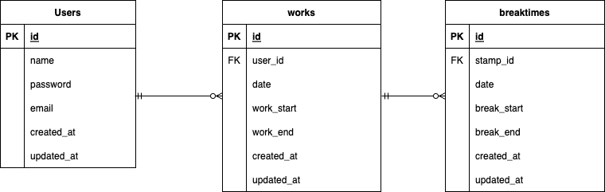

# Atte
勤怠管理システム

## 作成目的
この勤怠管理システムは従業員の出退勤、休憩、労働時間を記録するために作成しました。

## アプリURL
- http://localhost/login

## 他のリポジトリ

## 機能一覧
- ユーザー認証（会員登録・ログイン・ログアウト）
- 勤怠打刻（出勤・退勤・休憩開始・休憩終了）
- 勤怠記録の一覧表示（日付ごと・会員ごと）

## 使用技術
**言語・フレームワーク**
- PHP 7.3以上
- Laravel 8.0

**データベース**
- MySQL

**認証機能**
- Laravel Fortify

## テーブル設計

**usersテーブル**

- id (unsigned int)/primary key
- name (verchar(255))
- password (verchar(255))
- email (verchar(255))/unique key
- created_at (timestamp)
- updated_at (timestamp)

**worksテーブル**
- id (incriments)/primary key
- user_id (unsigned int)/foreign key
- date (date)
- work_start (dateTime)
- work_end (dateTime)
- created_at (timestamp)
- updated_at (timestamp)

**breaktimesテーブル**
- id (incriments)/primary key
- work_id (unsigned int)/foreign key
- date (date)
- break_start (dateTime)
- break_end (dateTime)
- created_at (timestamp)
- updated_at (timestamp)

## ER図

## 環境構築
**Dockerビルド**
- git clone https://github.com/tsugumi-shibata/Atte
- **DockerDesktopアプリを立ち上げる**
- docker-compose up -d --build

**Laravel環境構築**

- docker-compose exec php bash
- composer install
- 「.env.example」ファイルを 「.env」ファイルに命名を変更。または、新しく.envファイルを作成
- .envに以下の環境変数を追加

DB_CONNECTION=mysql

DB_HOST=mysql

DB_PORT=3306

DB_DATABASE=laravel_db

DB_USERNAME=laravel_user

DB_PASSWORD=laravel_pass
- アプリケーションキーの作成
- php artisan key:generate
- マイグレーションの実行
- php artisan migrate
- シーディングの実行
- php artisan db:seed

## その他

